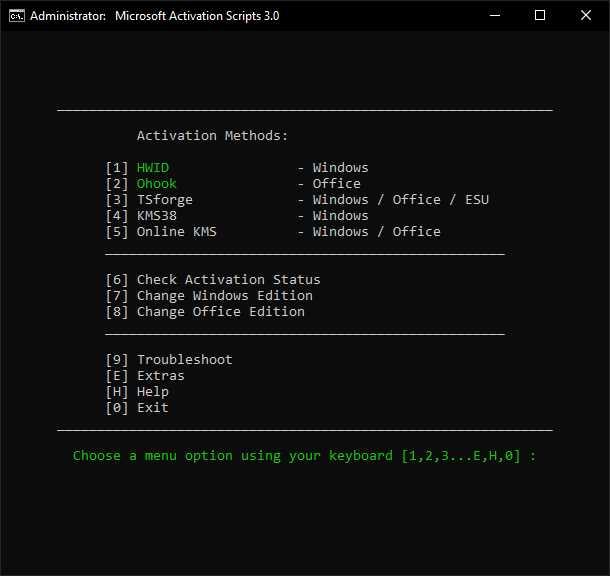
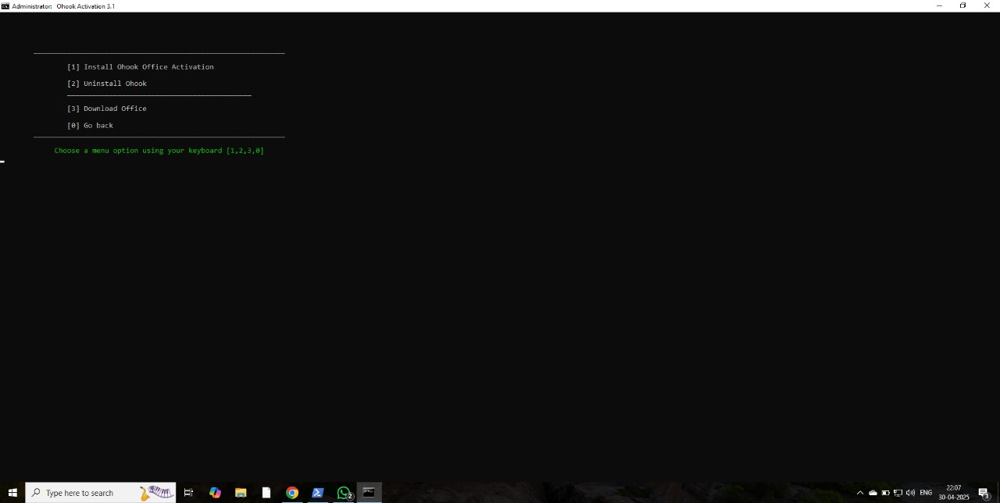
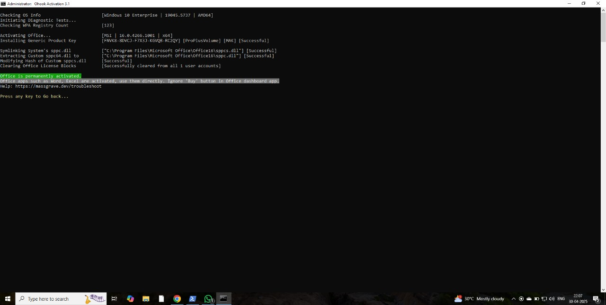

# MS_Office-By-Pass
This project provides a simple method to activate Microsoft Office products using a PowerShell command that downloads and runs a popular community script from massgrave.dev. The script supports multiple versions of Microsoft Office, including Office 2010 through Office 2021 and Microsoft 365 (Volume License).


 
# Microsoft Office Activator (PowerShell Script)

> ⚠️ **Disclaimer:** This project is for **educational purposes only**. Bypassing Microsoft’s activation system may violate its terms of service. Always consider purchasing a legal license from Microsoft or its authorized partners.

---

## 🔑 About

This PowerShell script is used to activate various versions of **Microsoft Office** without a product key by utilizing a community-maintained script hosted at [massgrave.dev](https://massgrave.dev). It simplifies the activation process using a one-liner PowerShell command that downloads and executes the script in memory.

---

## 📌 Supported Microsoft Office Versions

- Office 2010  
- Office 2013  
- Office 2016  
- Office 2019  
- Office 2021  
- Microsoft 365 (Volume License Only)

---

## ⚙️ How to Use (PowerShell Method)

1. **Open Windows PowerShell as Administrator**
   - Press `Win + X` and select **Windows PowerShell (Admin)**

2. **Run the Following Command:**

   ```powershell
   irm https://massgrave.dev/get | iex
   ```

   - This command uses `Invoke-RestMethod` (alias `irm`) to fetch the activation script and `Invoke-Expression` (alias `iex`) to execute it.

3. **Follow the On-Screen Menu**
   ## First Enter 2 for MS office 
   
   <br>
   
    ## Then Enter 1 for MS office 
   
   <br>
    ## Press any key for exit  
  


5. **Run your MS office Application**
  

---

## ⚠️ Important Notes

- **Always connect to a private internet connection (e.g., mobile hotspot)**, not through a VPN or proxy.
- Make sure **PowerShell execution policy allows running remote scripts**. You may need to use:

   ```powershell
   Set-ExecutionPolicy RemoteSigned
   ```

- **Antivirus software may block or remove the script**, as it modifies licensing information.

---

## ✅ Verify Activation

After the process, you can verify activation by opening any Office app and navigating to:

> **File → Account → Product Information**

---

## 📚 Credits

Script and activation tools are maintained by the open-source community at [https://massgrave.dev](https://massgrave.dev).

---

```

Let me know if you also want a version for GitHub or GitBook formatting, or one with images and badges.
